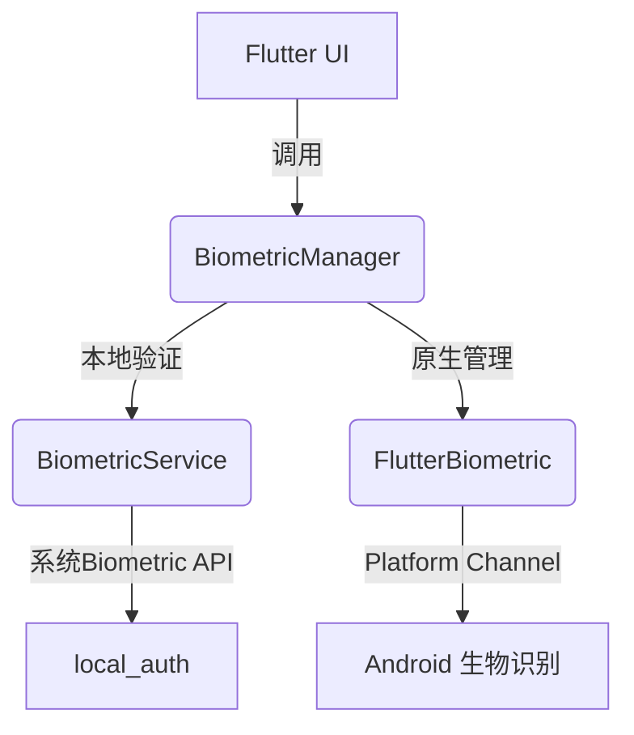

# Flutter 生物识别模块

这是一个 Flutter 生物识别插件，提供指纹识别和管理功能。该插件封装了原生 Android 的生物识别 API，使得 Flutter 应用可以轻松实现指纹识别和管理功能。

## 功能特性

- 生物识别验证（指纹/面部）
- 指纹数据管理（添加/删除/验证）
- 原生指纹管理界面
- 测试功能支持

## 安装

在 `pubspec.yaml` 中添加依赖：

```yaml
dependencies:
  flutter_biometric: ^0.0.1
```

## 使用方法

### 导入插件

```dart
import 'package:flutter_biometric/flutter_biometric.dart';
```

### 创建插件实例

```dart
final flutterBiometric = FlutterBiometric();
```

### 检查设备是否支持生物识别

```dart
bool isSupported = await flutterBiometric.isBiometricSupported();
print('设备支持生物识别: $isSupported');
```

### 进行生物识别验证

```dart
bool authenticated = await flutterBiometric.authenticate(
  title: '生物识别验证',
  subtitle: '请验证您的身份',
  description: '使用您的指纹或面部进行身份验证',
  negativeButtonText: '取消',
);

if (authenticated) {
  print('验证成功');
} else {
  print('验证失败');
}
```

### 指纹管理

#### 获取指纹数量

```dart
int count = await flutterBiometric.getFingerprintCount();
print('指纹数量: $count');
```

#### 获取所有指纹

```dart
List<String> fingerprints = await flutterBiometric.getAllFingerprints();
print('指纹列表: $fingerprints');
```

#### 添加指纹

```dart
bool success = await flutterBiometric.addFingerprint();
print('添加指纹: ${success ? "成功" : "失败"}');
```

#### 删除指纹

```dart
bool success = await flutterBiometric.deleteFingerprint(0); // 删除索引为0的指纹
print('删除指纹: ${success ? "成功" : "失败"}');
```

#### 清除所有指纹

```dart
bool success = await flutterBiometric.clearAllFingerprints();
print('清除所有指纹: ${success ? "成功" : "失败"}');
```

#### 验证指纹

```dart
bool verified = await flutterBiometric.verifyFingerprint('指纹哈希值');
print('验证结果: ${verified ? "成功" : "失败"}');
```

### 显示原生指纹管理界面

```dart
await flutterBiometric.showFingerprintManager();
```

### 测试功能

#### 设置测试指纹

```dart
await flutterBiometric.setupTestFingerprint();
```

#### 测试指纹验证

```dart
bool verified = await flutterBiometric.testFingerprintVerification();
print('测试验证结果: ${verified ? "成功" : "失败"}');
```

## 注意事项

1. 使用前请确保已经在 AndroidManifest.xml 中添加相关权限：

```xml
<uses-permission android:name="android.permission.USE_BIOMETRIC" />
```

2. 该插件目前仅支持 Android 平台，iOS 平台将在未来版本中支持。

3. 测试功能仅用于开发和测试环境，请勿在生产环境中使用。

## 示例

完整示例可参考 `example` 目录下的示例项目。

## 项目结构

```text
flutter_biometric/
├── android/                  # Android 原生插件实现
├── example/                  # 示例应用
├── lib/
│   ├── flutter_biometric.dart  # 旧版插件主入口（向后兼容）
│   └── src/                  # 新版功能分层目录
│       ├── biometric/        # BiometricService 和 BiometricManager
│       ├── ui/               # Flutter UI 页面
│       └── utils/            # 公用工具类 (BiometricUtils)
├── pubspec.yaml
└── README.md
```

## 功能分层

- **Service 层（`src/biometric/biometric_service.dart`）**
  - 封装 `local_auth` 插件，仅与系统生物识别 API 交互。
  - 提供设备支持检查、获取生物识别类型、原子级验证接口。

- **Manager 层（`src/biometric/biometric_manager.dart`）**
  - 协调 Service 层与原生插件功能。
  - 实现高级业务逻辑（例如录入前验证、操作后刷新）。

- **UI 层（`src/ui/`）**
  - `FingerprintManagementPage`：指纹管理 Flutter 页面。
  - 状态展示、操作入口、错误提示等。

- **工具类（`src/utils/biometric_utils.dart`）**
  - 用户友好名称、图标映射、哈希格式化等辅助方法。

## 基础调用策略

1. **初始化**：
   ```dart
   final manager = BiometricManager();
   ```

2. **检查设备状态**：
   ```dart
   final status = await manager.checkBiometricStatus();
   if (status == BiometricStatus.available) {
     // 生物识别可用
   }
   ```

3. **身份验证**：
   ```dart
   bool ok = await manager.authenticate(reason: '验证您的身份');
   ```

4. **指纹管理**：
   - 添加：`await manager.addFingerprint();`
   - 删除：`await manager.deleteFingerprint(index);`
   - 清除：`await manager.clearAllFingerprints();`
   - 打开系统/原生管理界面：`await manager.showFingerprintSettings(context);`

## 系统流程图



## 许可证

MIT License

